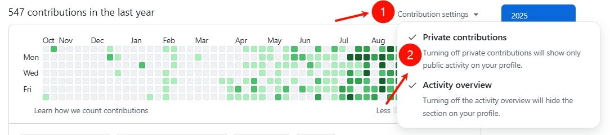

# GreenWall 🎨

> 中文: [README (中文)](README_zh.md)

**GreenWall** is a desktop application that helps you create artistic GitHub contribution graphs. Draw text, patterns, and emojis on your profile with multi-language repositories.

## ✨ Features

- 🎨 Draw letters, numbers, and emoji patterns on your contribution graph
- 📊 Support multiple programming languages (Java, Python, Go, Rust, C++, JavaScript, TypeScript, Vue, etc.)
- 🎯 Precisely control language statistics (based on GitHub Linguist algorithm)
- 🔐 OAuth 2.0 GitHub integration
- 🚀 Direct push to GitHub repositories

## 🚀 Quick Start

1. Download and install GreenWall
2. Log in with your GitHub account
3. Draw patterns on the calendar
4. Configure languages and ratios (optional)
5. Generate and push to GitHub

## 💡 Tips

- Set repositories to private and enable "Private contributions" in GitHub settings
- GitHub may take 5 minutes to 2 days to update your contribution graph
- Use "Force Push" if the repository already has content

## 🛠️ Tech Stack

- **Frontend**: React + TypeScript + Vite + TailwindCSS
- **Backend**: Go + Wails v2
- **Algorithm**: Based on GitHub Linguist (byte-based calculation)

## 📄 License

MIT License

## Star History

## 👏 Credits

Forked from [zmrlft/GreenWall](https://github.com/zmrlft/GreenWall) with enhancements:
- Multi-language support
- Language statistics control
- Dark mode
- OAuth 2.0 integration

## Disclaimer

This project is provided for educational, demonstration, and research purposes related to GitHub contribution mechanics. Misuse (for example to falsify job applications) is the user's responsibility.
