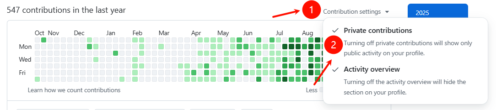

# GreenWall 🎨

> English: [README (English)](README.md)

**GreenWall** 是一个桌面应用程序，帮助你在 GitHub 贡献图上创作艺术作品。在个人主页上绘制文字、图案和表情符号，支持多语言仓库。

## ✨ 功能特性

- 🎨 在贡献图上绘制字母、数字和表情图案
- 📊 支持多种编程语言（Java, Python, Go, Rust, C++, JavaScript, TypeScript, Vue 等）
- 🎯 精确控制语言统计（基于 GitHub Linguist 算法）
- 🔐 OAuth 2.0 GitHub 集成
- 🚀 直接推送到 GitHub 仓库

## 🚀 快速开始

1. 下载并安装 GreenWall
2. 使用 GitHub 账号登录
3. 在日历上绘制图案
4. 配置语言和比例（可选）
5. 生成并推送到 GitHub

## 💡 使用技巧

- 将仓库设为私有，并在 GitHub 设置中启用"私有贡献"
- GitHub 可能需要 5 分钟到 2 天来更新贡献图
- 如果仓库已有内容，使用"强制推送"选项

## 🛠️ 技术栈

- **前端**：React + TypeScript + Vite + TailwindCSS
- **后端**：Go + Wails v2
- **算法**：基于 GitHub Linguist（字节数计算）

## 📄 许可证

MIT License

## Star History

## 👏 致谢

Fork 自 [zmrlft/GreenWall](https://github.com/zmrlft/GreenWall)，增强功能包括：
- 多语言支持
- 语言统计控制
- 深色模式
- OAuth 2.0 集成

## 免责声明

本项目仅用于教育、演示及研究 GitHub 贡献机制。如用于求职造假等不当用途，所造成后果由使用者自负。
